---

# 🧠 Lame - Hack The Box (HTB)

> Análisis técnico, didáctico y documentado por **r4ms4nt**.

📅 **Fecha:** Mayo 2025
🎯 **Objetivo:** Reproducir y documentar la resolución de la máquina *Lame*, la primera máquina publicada por Hack The Box.

---

## 🎯 Objetivos del proyecto

* Desarrollar una metodología práctica de hacking ético.
* Aplicar técnicas reales de reconocimiento, enumeración y explotación.
* Practicar documentación profesional para entornos de certificación (OSCP, eJPT…).

---

## 📁 Estructura del repositorio

```bash
.
├── capturas
├── nmap
├── LICENSE
├── README.md
├── gitignore
├── lame_htb_manual.md
└── tree_lame.txt
```

📄 Ver estructura completa: [tree\_lame.txt](tree_lame.txt)

---

## 🔍 Task 1: How many of the nmap top 1000 TCP ports are open?

🎯 **Objetivo:** Identificar puertos TCP abiertos más comunes.

✅ **Comando ejecutado:**

```bash
nmap -sS -Pn --top-ports 1000 -oA nmap/top1000_tcp 10.129.56.2
grep open nmap/top1000_tcp.nmap
```

🔎 **Resultado:**

* Puertos abiertos: `21`, `22`, `139`, `445`
* Total: **4**

📸 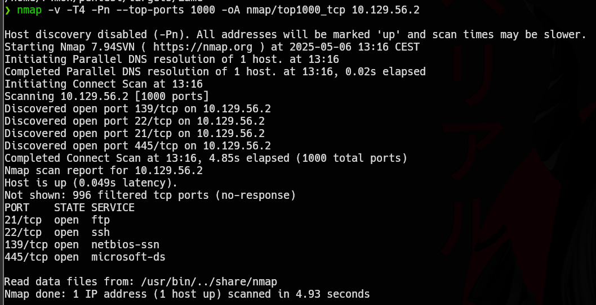 | 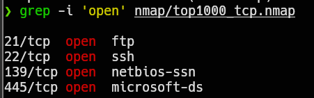

---

## 🔍 Task 2: What version of VSFTPd is running on Lame?

🎯 **Objetivo:** Determinar la versión del servicio FTP en el puerto 21.

✅ **Comando ejecutado:**

```bash
nmap -sV -p21 -oA nmap/ftp_version 10.129.56.2
```

🔎 **Resultado:**

* Servicio: **vsFTPd 2.3.4**

📸 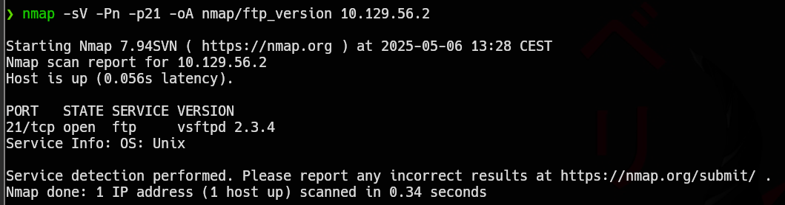

---

## 🔍 Task 3: ¿Funciona el famoso exploit de VSFTPd 2.3.4?

🎯 **Objetivo:** Verificar si la vulnerabilidad conocida de backdoor está activa.

✅ **Comando ejecutado (en Metasploit):**

```bash
msfconsole
use exploit/unix/ftp/vsftpd_234_backdoor
set RHOSTS 10.129.56.2
run
```

🔎 **Resultado:**

* El exploit se ejecuta pero **no devuelve sesión**.

📸 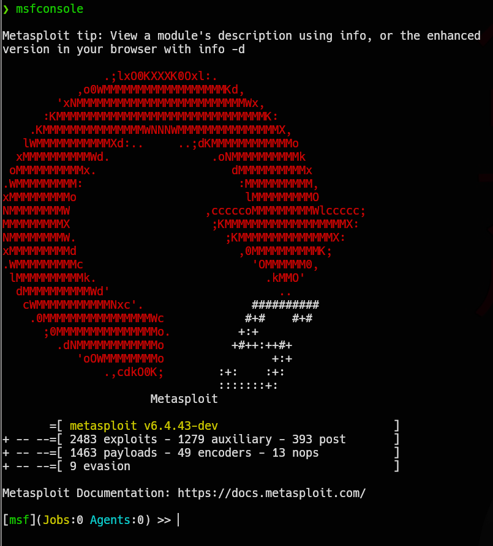 | 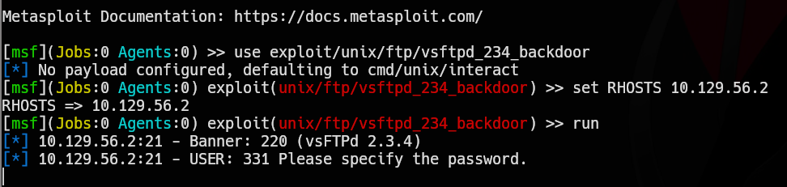 | 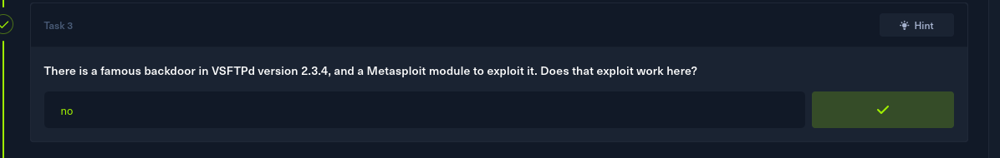

---

## 🔍 Task 4: ¿Qué versión de Samba corre en Lame?

🎯 **Objetivo:** Enumerar la versión del servicio Samba en los puertos 139 y 445.

✅ **Comando ejecutado:**

```bash
nmap -sV -Pn -p139,445 --script=smb-protocols,smb-os-discovery,smb2-security-mode,smb2-time -oA nmap/smb_version 10.129.56.2
```

🔎 **Resultado:**

* Versión detectada: **Samba 3.0.20**

📸 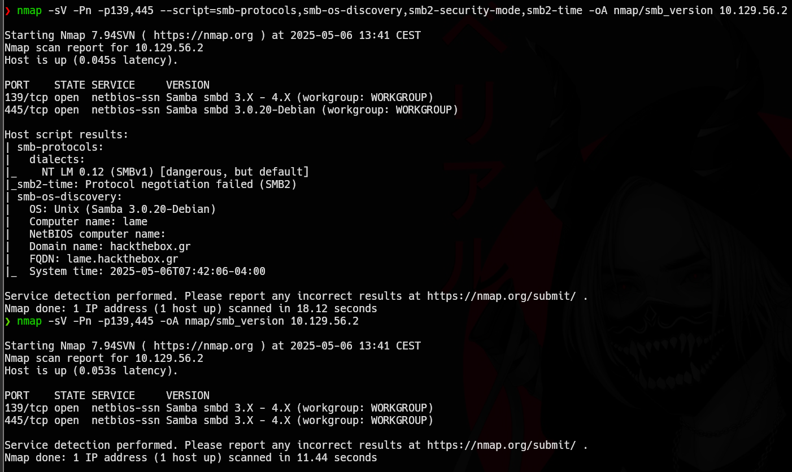

---

## 🔍 Task 5: ¿Qué CVE del 2007 permite RCE en esta versión de Samba?

🎯 **Objetivo:** Identificar una vulnerabilidad histórica en la versión de Samba.

✅ **Referencia:**

* `CVE-2007-2447`
* Condición: uso de `username map script` en `smb.conf`

📸 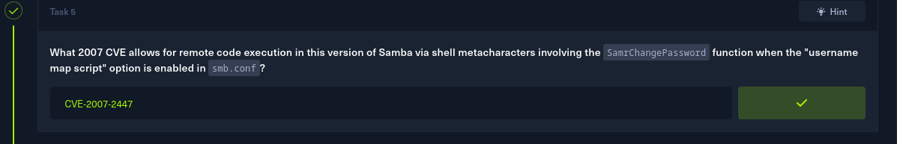

---

## 🔍 Task 6: ¿Qué usuario obtiene shell al explotar CVE-2007-2447?

🎯 **Objetivo:** Determinar el contexto del shell recibido tras la explotación.

✅ **Resultado:**

* Usuario: **root**

📸 

---

## 🔍 Task 7: Obtener la flag del usuario `makis`

🎯 **Objetivo:** Localizar y leer el archivo `user.txt`.

✅ **Comandos ejecutados:**

```bash
cd /home/makis
ls -la
cat user.txt
```

📸 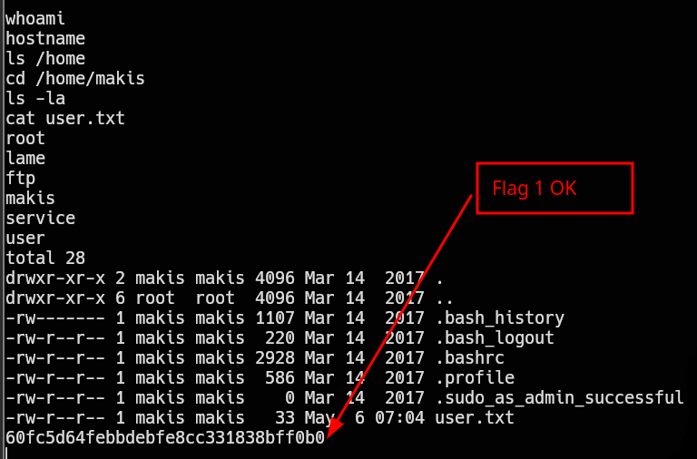

---

## 🔍 Task 8: Obtener la flag del usuario `root`

🎯 **Objetivo:** Escalar privilegios y leer `/root/root.txt`

✅ **Comandos ejecutados:**

```bash
cd /root
ls -la
cat root.txt
```

📸 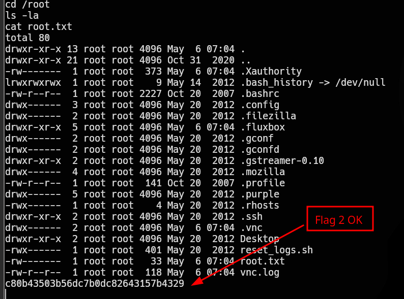

---

## 🔍 Task 9: ¿Qué impide la conexión a ciertos puertos visibles con `netstat`?

🎯 **Objetivo:** Explicar por qué no todos los puertos escuchando son accesibles desde fuera.

✅ **Comando ejecutado:**

```bash
netstat -tnlp
```

🔎 **Resultado:**

* Causa: **firewall**

📸 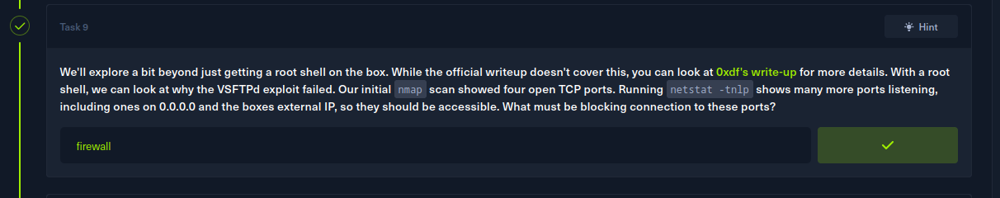

---

## 🔍 Task 10: ¿Qué puerto escucha cuando se activa el backdoor de VSFTPd?

🎯 **Objetivo:** Confirmar el comportamiento del backdoor.

✅ **Resultado:**

* Puerto: **6200**

📸 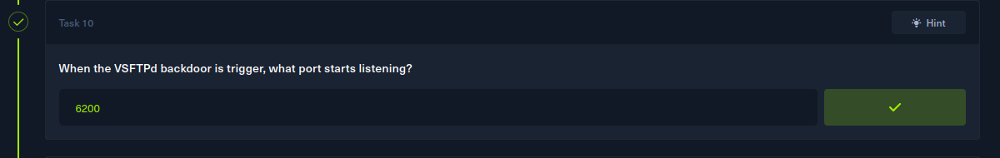

---

## 🔍 Task 11: ¿El puerto 6200 escucha realmente en Lame?

🎯 **Objetivo:** Verificar con netstat si efectivamente se activa el puerto.

✅ **Comando ejecutado:**

```bash
ss -tnlp | grep 6200
```

🔎 **Resultado:**

* Sí, escucha.

📸 

---

